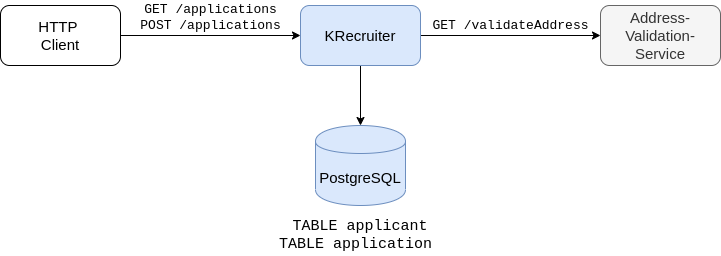

# KRecruiter

Example application to train writing tests with Kotlin. The application uses a database and calls a remote service in order to be as close to the testing reality as possible.  

# Big Picture



# Setup

Requirements:

- Docker
- Docker-Compose
- Java 11
- IntelliJ IDEA
- IntelliJ IDEA Plugin "KotlinTest"
- Optional: HTTP Client [httpie](https://httpie.org/) or [Postman](https://www.getpostman.com/) to try the HTTP API 

```bash
git clone git@github.com:phauer/krecruiter.git
cd krecruiter

# start a PostgreSQL, adminer, and a stub for the address-validation-service
docker-compose up

# a) start the RecrutingAppApplication.kt via IntelliJ (recommended)
# or b) run
./mvnw spring-boot:run

# test with
curl localhost:8080/applications
```

Optionally, you can download the sources of all libraries up front:

```bash
./mvnw dependency:sources
```

# Inspect the PostgreSQL

You can use your favorite SQL Client or the [adminer](https://www.adminer.org/) - a simple Web UI that is already started with docker-compose. Open [http://localhost:900/?pgsql=db&username=user&db=krecruiter&ns=public](http://localhost:900/?pgsql=db&username=user&db=krecruiter&ns=public) in the browser. Use `password` for the password. You can also look up the database configuration in the `docker-compose.yml`.

# Trying the API

## GET `/applications`

```
~ ❯❯❯ http localhost:8080/applications
HTTP/1.1 200 
Content-Type: application/json
Date: Thu, 17 Oct 2019 18:19:04 GMT
Transfer-Encoding: chunked

[
    {
        "dateCreated": 1226431079.725,
        "fullName": "Mose Hintz",
        "id": 315,
        "jobTitle": "Future Construction Coordinator",
        "state": "RECEIVED"
    },
    ...
]
```

## POST `/applications`

```
~ ❯❯❯ http POST localhost:8080/applications firstName="Peter" lastName="Meier" street="Main Street 2" city="Cologne" jobTitle="Software Engineer" -v
POST /applications HTTP/1.1
Accept: application/json, */*
Accept-Encoding: gzip, deflate
Connection: keep-alive
Content-Length: 122
Content-Type: application/json
Host: localhost:8080
User-Agent: HTTPie/1.0.3

{
    "city": "Cologne",
    "firstName": "Peter",
    "jobTitle": "Software Engineer",
    "lastName": "Meier",
    "street": "Main Street 2"
}

HTTP/1.1 201 
Content-Length: 0
Date: Wed, 20 Nov 2019 11:58:32 GMT
Location: /applications/3


```

# Tasks

The tasks can be found [here](tasks.md).